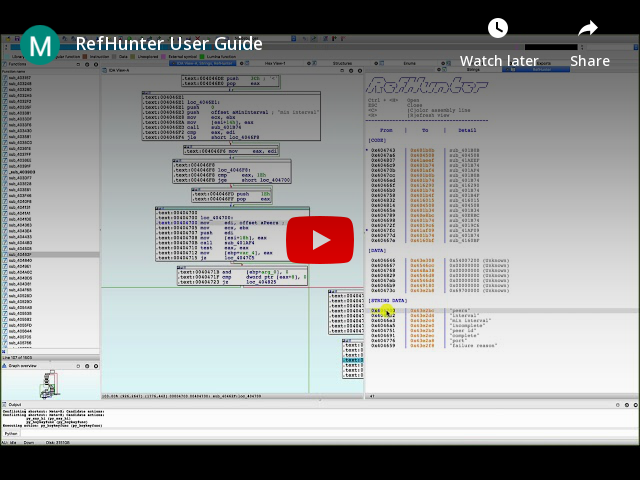

# IDARefHunter
*Updated*: This project's been introduced on [IDA Plugin Contest 2021](https://hex-rays.com/contests_details/contest2021/#RefHunter)!

 

 
 

-----

## Why do we need RefHunter?
Getting reference information in ***one specific function*** is the secret to find out the connection between lines.  
- Comparing two function's ***subroutine lists*** is one of the simplest diffing tequnique.     
- By just seeing the ***string list*** referenced in the function, we can infer the sketchy role of the function.  

However, among the all of fancy features in IDA, getting ***all reference information*** in ***one specific function*** hasn't available so far.  

### That's where "***RefHunter**: User-friendly function reference finder*" comes in. 

 

-----

## RefHunter
**RefHunter** find all references in simple and lightweighted manner.  
- User-friendly view  
- Runs without any 3rd-party application
- Runs without installing itself, it's just portable.  
- Analyze the function and show tiny little ***report*** for you!  

 

-----

## Usage 

| Key | Description |
| -------- | ----------- |
| <kbd>Ctrl</kbd> + <kbd>H</kbd> | Open the Ref<ins>**H**</ins>unter view |
| <kbd>ESC</kbd> | Close the RefHunter view |
| <kbd>C</kbd> or <kbd>c</kbd> | <ins>**C**</ins>olor the selected reference in assembly line |
| <kbd>R</kbd> or <kbd>r</kbd> | <ins>**R**</ins>efresh view |

 

----
## Installation
1. Download this repository
2. Open IDA > [File] > [Script File] > Select ***RefHunter.py***

 

-----

## Requirement
- IDA version 7 >= with IDAPython  
- Tested on **7.6** with Python **2.7.16**

 

-----

## Video guide
Short video guide (<2min)

